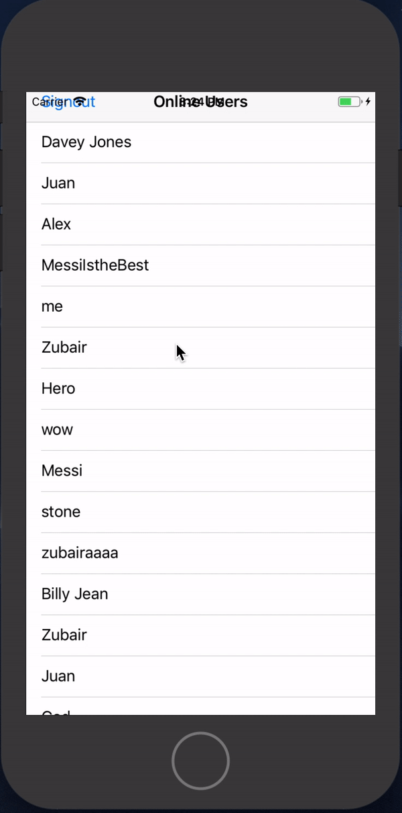

# Chaos Coms

An iOS chat application coded in Swift which sens a random YouTube video to users by seaerch for keywords the messages sent.

---

## Team

| <a href="#" target="_blank">**Stone Keach**</a> | <a href="#" target="_blank">**Zubair Amjad**</a> | <a href="#" target="_blank">**Juan Acevedo**</a> |
| :---: |:---:| :---:|
| |  |  |  
| <a href="https://github.com/StoneSolidCode" target="_blank">`Stone Keach`</a> | <a href="https://github.com/amjadz" target="_blank">`Zubair Amjad `</a> | <a href="https://github.com/acevedoj" target="_blank">`Juan Acevedo`</a> |
---

## Features

- Used Swfit to code the functionality of the app.
- Utilized Firebase Database to save the user messages and user profiles.
- Utilzed Firebase Authentication to allow users to sign up with an email address.
- Utilzed Swifts natural langauage proccessing to analyze the message.
- Utilzed the Youtube API to send the random YouTube video after the message that is sent has been analyzed.

---

## Contact

Reach out to me at one of the following places!

- <a href="https://www.linkedin.com/in/zubair-amjad/" target="_blank">`LinkedIn`</a>
- <a href="https://www.facebook.com/ZubairAmjad" target="_blank">`Facebook`</a>

---

## License

- **[MIT license](http://opensource.org/licenses/mit-license.php)**
- Copyright 2018 © <a href="https://github.com/amjadz" target="_blank">Zubair Amjad</a>.
